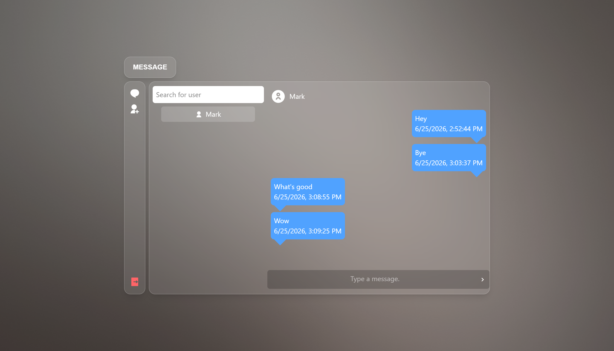

#  REACT CHAT APPLICATION WITH SOCKET.IO 

A real-time chat application that uses React, NodeJS, Socket.io.


## Screenshot



## Get Started
In order to run this application on your machine, Follow these steps:<br>
1. Clone this project  
```bash
    git clone https://github.com/AbdinatifM/ChatApp.git     
```
2. Install frontend dependencies
```bash
    cd frontend
    npm install
```
3. Install backend dependencies
```bash
    cd backend
    npm install
```

## Run
Run this command in both directories to start the server.
```bash
npm run dev
```

## Technologies Used
 - React
 - ExpressJs
 - Socket.io
 - TailwindCSS


## Live Demo 
[Live site](https://abdinatifm-chat-app.vercel.app/)
##### Credentials: 
* Username: `Johndoe` Password: `Password`
* Username: `Mark` Password: `Password`